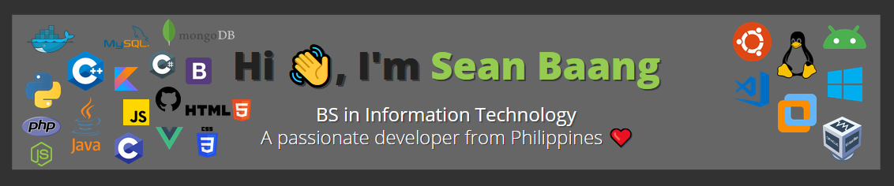

  

  

- 🔭 I’m currently working on **Nothing** for now. :smiley:

- 🌱 I’m currently learning **PHP** and **Laravel**.

<h3 align="left">Connect with me:</h3>

<h3 align="center">Languages:</h3>

  

<h3 align="center">Tools:</h3>

  

&nbsp;

